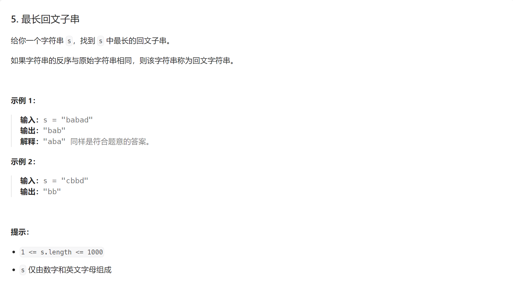
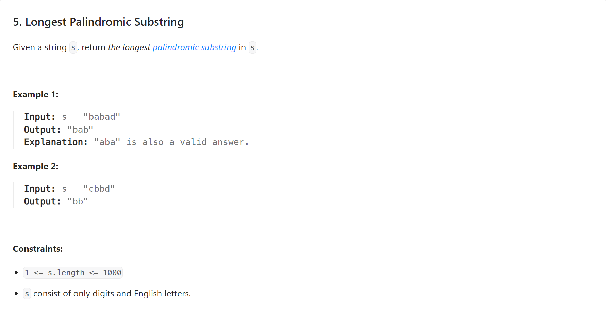

# 【LeetCode】动态规划


[toc]


## 5. 最长回文子串





相关视频：[史上最燃算法刷题！Leetcode 5. 最长回文子串](https://www.bilibili.com/video/BV1dN4y1g7p9/)

AC代码（Java）：

```java
class Solution {
    public String longestPalindrome(String s) {
        char[] arr = s.toCharArray();
        boolean[][] dp = new boolean[arr.length][arr.length];
        String ans = "";
        for (int i = arr.length - 1; i >= 0; i--) {
            for (int j = arr.length - 1; j >= i; j--) {
                if (i == j) {
                    dp[i][j] = true;
                } else if (i + 1 == j) {
                    dp[i][j] = arr[i] == arr[j];
                } else {
                    dp[i][j] = dp[i + 1][j - 1] && arr[i] == arr[j];
                }
                if (dp[i][j] && ans.length() < j - i + 1) {
                    ans = s.substring(i, j + 1);
                }
            }
        }
        return ans;
    }
}
```

