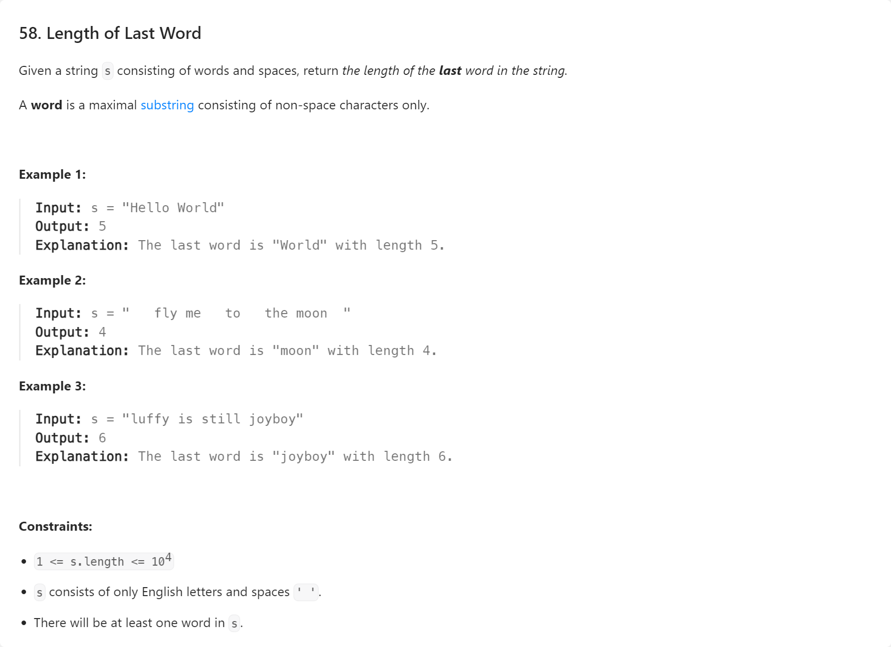

# 【LeetCode】字符串


[toc]


## 58. 最后一个单词的长度




AC代码（Java）：

```java
class Solution {
    public int lengthOfLastWord(String s) {
        String[] arr = s.trim().split("\\s+");
        return arr[arr.length - 1].length();
    }
}
```


## 125. 验证回文串


AC代码（Java）：

```java
class Solution {
    public boolean isPalindrome(String s) {
        char[] arr = s.toLowerCase().replaceAll("[^a-z0-9]", "").toCharArray();
        for (int i = 0; i < arr.length / 2; i++) {
            if (arr[i] != arr[arr.length - 1 - i]) {
                return false;
            }
        }
        return true;
    }
}
```


## 151. 反转字符串中的单词


相关题解：
[翻转字符串里的单词](https://leetcode.cn/problems/reverse-words-in-a-string/solutions/194450/fan-zhuan-zi-fu-chuan-li-de-dan-ci-by-leetcode-sol/)

AC代码（Java）：

```java
import java.util.Arrays;
import java.util.Collections;
import java.util.List;

class Solution {
    public String reverseWords(String s) {
        List<String> words = Arrays.asList(s.trim().split("\\s+"));
        Collections.reverse(words);
        return String.join(" ", words);
    }
}
```


