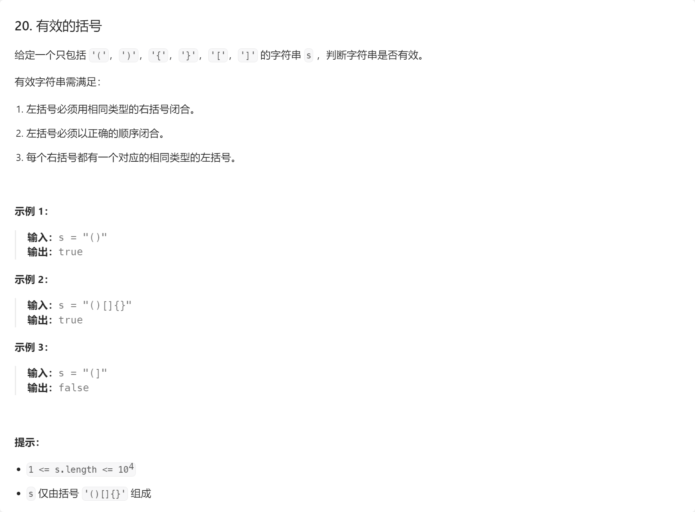
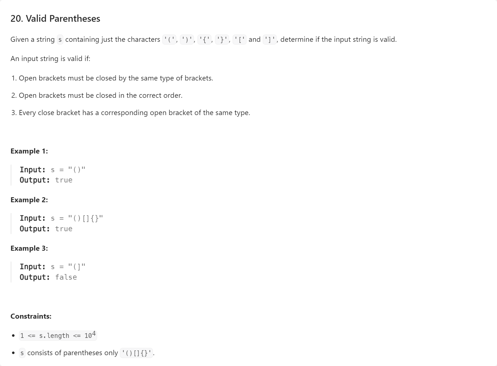
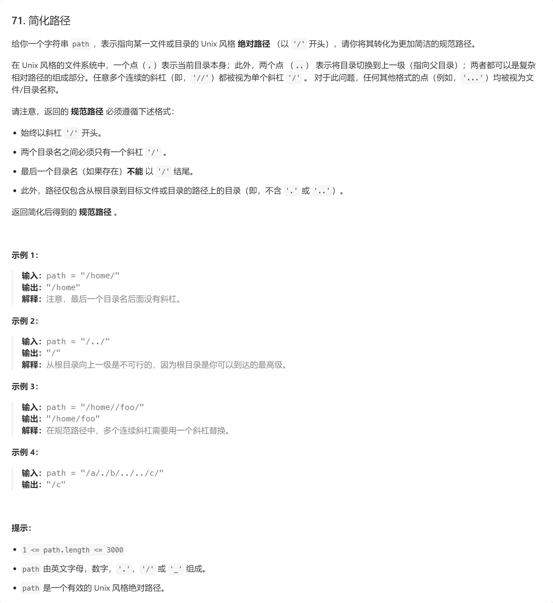
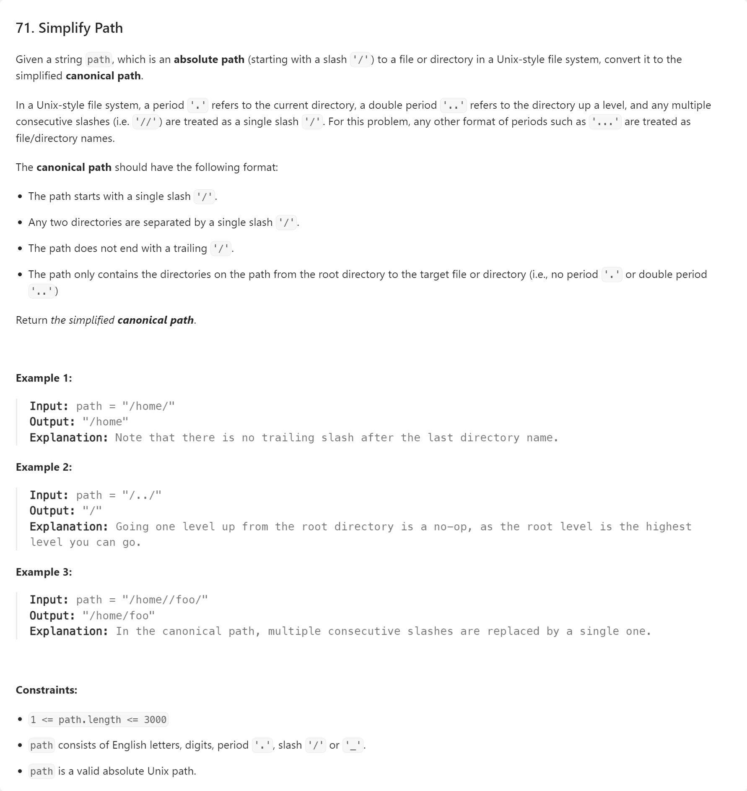

# 【LeetCode】栈


[toc]


## 20. 有效的括号





AC代码（Java）：

```java
import java.util.Stack;

class Solution {
    public boolean isValid(String s) {
        char[] arr = s.toCharArray();
        Stack<Character> stack = new Stack<>();
        for (char c : arr) {
            switch (c) {
                case '(':
                case '[':
                case '{':
                    stack.push(c);
                    break;
                case ')':
                    if (stack.empty() || stack.pop() != '(') {
                        return false;
                    }
                    break;
                case ']':
                    if (stack.empty() || stack.pop() != '[') {
                        return false;
                    }
                    break;
                case '}':
                    if (stack.empty() || stack.pop() != '{') {
                        return false;
                    }
                    break;
                default:
            }
        }
        return stack.empty();
    }
}
```


## 71. 简化路径





相关视频： [【LeetCode 每日一题】71. 简化路径 | 手写图解版思路 + 代码讲解](https://www.bilibili.com/video/BV1qF411s7Jy)

AC代码（Java）：

```java
import java.util.ArrayDeque;
import java.util.Deque;

class Solution {
    public String simplifyPath(String path) {
        String[] directories = path.split("/");
        Deque<String> deque = new ArrayDeque<>();
        for (String directory : directories) {
            switch (directory) {
                case "":
                case ".":
                    break;
                case "..":
                    if (!deque.isEmpty()) {
                        deque.removeLast();
                    }
                    break;
                default:
                    deque.addLast(directory);
            }
        }
        if (deque.isEmpty()) {
            return "/";
        }
        String simplifiedPath = "";
        while (!deque.isEmpty()) {
            String directory = deque.removeFirst();
            simplifiedPath = simplifiedPath.concat("/").concat(directory);
        }
        return simplifiedPath;
    }
}
```

