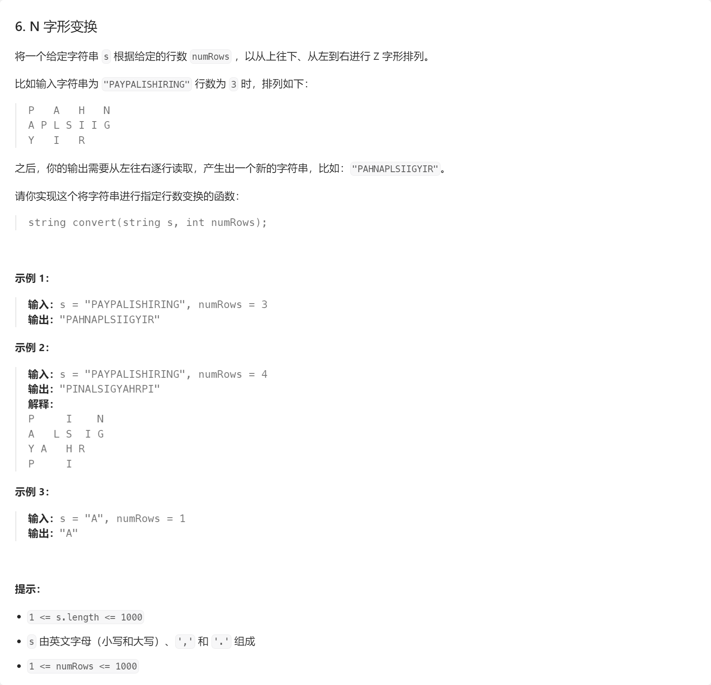
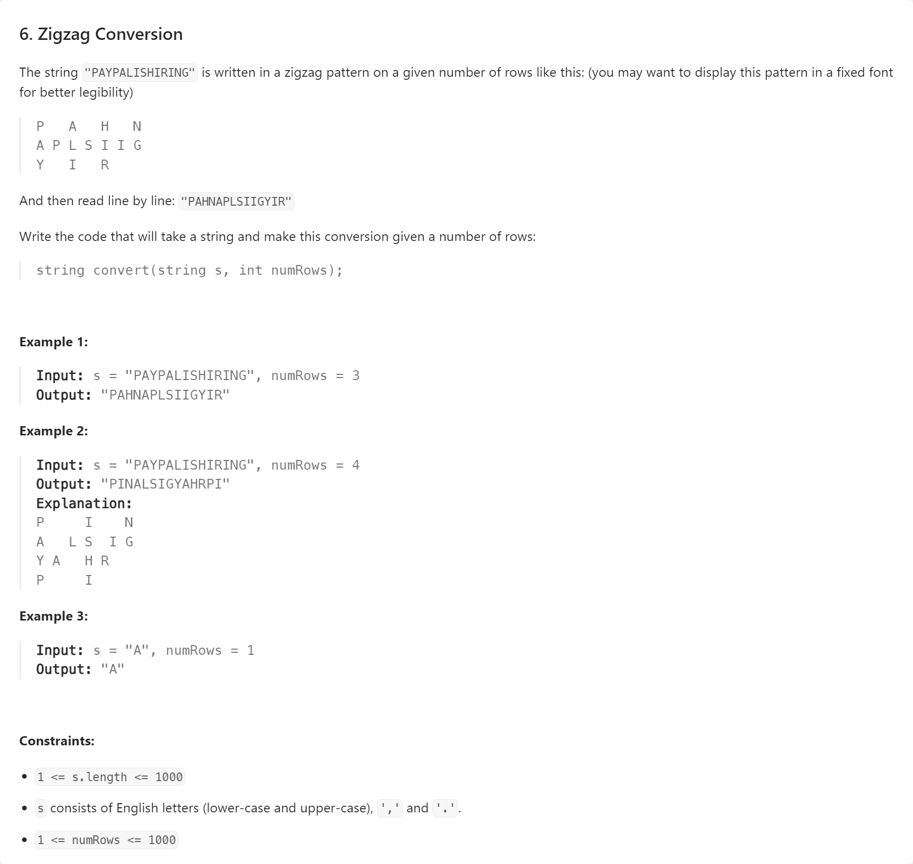

# 【LeetCode】矩阵


[toc]


## 矩阵遍历

```java
public class Main {
    public static void main(String[] args) {
        int len = 7;
        for (int i0 = 0, j0 = 2; i0 >= 0 && i0 < len && j0 >= 0 && j0 < len; i0++, j0++) {
            for (int i = i0, j = j0; i >= 0 && i < len && j >= 0 && j < len; i--, j++) {
                System.out.println(String.format("[%s][%s]", i, j));
            }
        }
    }
}
```


## 6. N 字形变换





AC代码（Java）：

```java
class Solution {
    public String convert(String s, int numRows) {
        if (numRows == 1) {
            return s;
        }
        char[] arr = s.toCharArray();
        char[][] mat = new char[numRows][1000];
        int x = -1;
        int y = 0;
        int[] dx = {1, -1};
        int[] dy = {0, 1};
        int idx = 0;
        for (char c : arr) {
            if (x + dx[idx] < 0 || x + dx[idx] >= numRows) {
                idx = (idx + 1) % 2;
            }
            x = x + dx[idx];
            y = y + dy[idx];
            mat[x][y] = c;
        }
        StringBuilder ans = new StringBuilder();
        for (int i = 0; i < numRows; i++) {
            for (int j = 0; j <= y; j++) {
                if (mat[i][j] != '\u0000') {
                    ans.append(mat[i][j]);
                }
            }
        }
        return ans.toString();
    }
}
```

